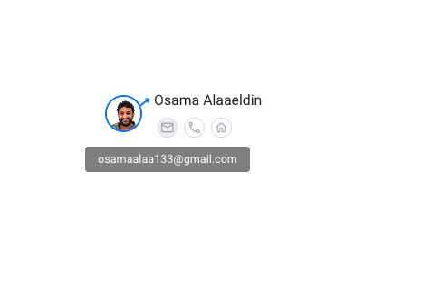
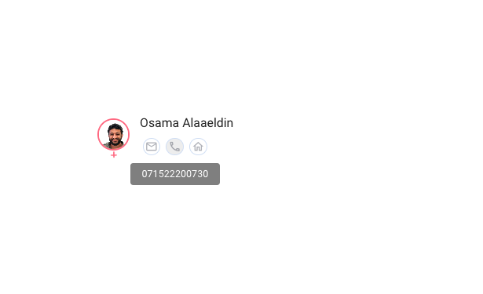
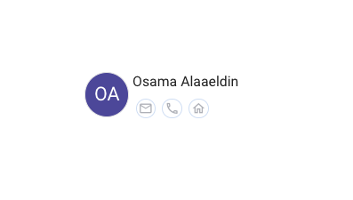

# NamePhoto Component

A Vue.js component that displays a user's name, photo, and contact information. This component is styled using SCSS and utilizes Vuetify for UI components. It supports displaying a photo, name, description, email, phone, and address with tooltips for the contact icons.

## Features

- Displays user's photo with gender-specific styling.
- Shows name, description, email, phone, and address.
- Contact icons with tooltips.
- Opens email client when clicking the email icon.
- Responsive design.
- Suitable for various use cases including table lists, headers, and sidebars.

## Screenshots

### Male User with Photo


### Female User with Photo


### User without Photo


## Installation

1. Clone the repository:

```bash
git clone https://github.com/osamaalaa/namePhoto.git
cd namePhoto